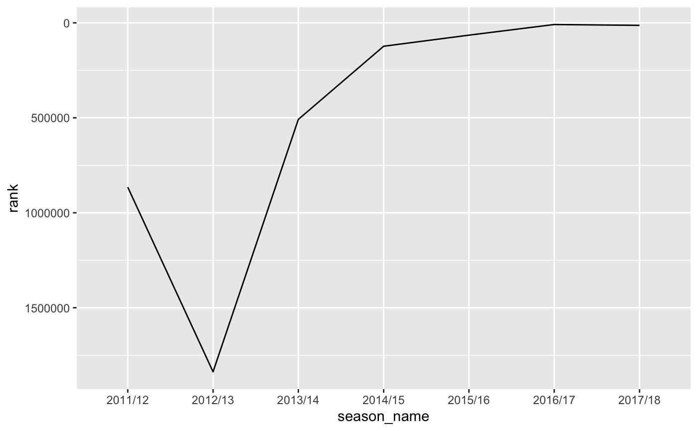

# fplr 

[](https://travis-ci.org/ewenme/fplr)
[](https://www.tidyverse.org/lifecycle/#experimental)

An R package housing a compendium of tools for working with [Fantasy
Premier League](https://fantasy.premierleague.com) (FPL) data in R.

## Installation

Get the latest development version of `fplr` from GitHub:

``` r
if (!require(remotes)) {
  install.packages("remotes") 
  }

# install package
remotes::install_github("ewenme/fplr")
```

Because of the lack of dev support from FPL and possible API changes,
the package is unlikely to be submitted to CRAN and will remain in an
experimental [lifecycle](https://www.tidyverse.org/lifecycle/) for the
foreseeable future.

## Usage

Refer to the [quickstart
guide](https://ewenme.github.io/fplr/articles/fplr-quickstart.html) to
get started. Still, here are some very basic examples of the
functionality and practical applications of `fplr`.

### Get data

…on all players in the current FPL season.

``` r
library(fplr)

players <- fpl_get_player_all()

players
## # A tibble: 624 x 58
##       id photo web_name team_code status   code first_name second_name
##    <int> <chr> <chr>        <int> <chr>   <int> <chr>      <chr>      
##  1     1 1133… Cech             3 a       11334 Petr       Cech       
##  2     2 8020… Leno             3 a       80201 Bernd      Leno       
##  3     3 5150… Kosciel…         3 a       51507 Laurent    Koscielny  
##  4     4 9874… Bellerín         3 i       98745 Héctor     Bellerín   
##  5     5 3841… Monreal          3 a       38411 Nacho      Monreal    
##  6     6 1560… Holding          3 i      156074 Rob        Holding    
##  7     7 6914… Mustafi          3 a       69140 Shkodran   Mustafi    
##  8     8 1114… Kolasin…         3 a      111457 Sead       Kolasinac  
##  9    10 2339… Mavropa…         3 a      233963 Konstanti… Mavropanos 
## 10    11 2733… Lichtst…         3 a       27335 Stephan    Lichtstein…
## # … with 614 more rows, and 50 more variables: squad_number <int>,
## #   news <chr>, now_cost <dbl>, news_added <chr>,
## #   chance_of_playing_this_round <int>,
## #   chance_of_playing_next_round <int>, value_form <dbl>,
## #   value_season <dbl>, cost_change_start <dbl>, cost_change_event <dbl>,
## #   cost_change_start_fall <int>, cost_change_event_fall <int>,
## #   in_dreamteam <lgl>, dreamteam_count <int>, selected_by_percent <dbl>,
## #   form <dbl>, transfers_out <int>, transfers_in <int>,
## #   transfers_out_event <int>, transfers_in_event <int>, loans_in <int>,
## #   loans_out <int>, loaned_in <int>, loaned_out <int>,
## #   total_points <int>, event_points <int>, points_per_game <dbl>,
## #   ep_this <dbl>, ep_next <dbl>, special <lgl>, minutes <int>,
## #   goals_scored <int>, assists <int>, clean_sheets <int>,
## #   goals_conceded <int>, own_goals <int>, penalties_saved <int>,
## #   penalties_missed <int>, yellow_cards <int>, red_cards <int>,
## #   saves <int>, bonus <int>, bps <int>, influence <dbl>,
## #   creativity <dbl>, threat <dbl>, ict_index <dbl>, ea_index <int>,
## #   element_type <int>, team <int>
```

…on a user’s FPL season performances.

``` r
user_performance <- fpl_get_user_season(user_id = 123)

user_performance
## # A tibble: 7 x 6
##         id season_name total_points    rank season  player
##      <int> <chr>              <int>   <int>  <int>   <int>
## 1 13210862 2011/12             1788  865160      6 9356614
## 2 19303061 2012/13             1590 1837292      7 9356614
## 3 20622589 2013/14             2135  508248      8 9356614
## 4 31254280 2014/15             2043  123156      9 9356614
## 5 34458590 2015/16             2178   64735     10 9356614
## 6 38105936 2016/17             2313    8699     11 9356614
## 7 42627235 2017/18             2304   13153     12 9356614
```

### Extract insight

Manipulate and visualise this data, in conjunction with
[dplyr](https://dplyr.tidyverse.org/) and
[ggplot2](https://ggplot2.tidyverse.org/) respectively.

For example, peek at points-per-90 vs player costs…

``` r
library(dplyr)
## 
## Attaching package: 'dplyr'
## The following objects are masked from 'package:stats':
## 
##     filter, lag
## The following objects are masked from 'package:base':
## 
##     intersect, setdiff, setequal, union
library(ggplot2)

players_filtered <- players %>% 
  # remove players without many minutes
  filter(minutes >= 900, !is.na(minutes)) %>% 
  # calc some metrics
  mutate(points_per_90 = (total_points / minutes) * 90)
  
# scatter plot of points per minute vs cost
ggplot(data = players_filtered, aes(x = points_per_90, y = now_cost)) +
  geom_jitter() +
  geom_text(
    aes(label = web_name), nudge_y = -0.2, size = 3,
    data = filter(players_filtered, points_per_90 >= quantile(points_per_90, 0.95) | now_cost >= quantile(now_cost, 0.95))
    )
```

<!-- -->

…or track your personal performance over the years.

``` r
# rank by season
ggplot(data = user_performance, aes(x = season_name, y = rank, group = 1)) +
  geom_line() +
  # reverse the y-axis
  scale_y_reverse()
```

<!-- -->

## In-the-wild

  - […xPoints?](https://ewen.io/2019/03/08/xpoints/)
  - [FPL Mythbusting with
    fplr](https://ewen.io/2017/06/25/fpl-mythbusting-with-fplr/)

## Collaborators

If you want to contribute to the package, try and follow:

  - Principles in Hadley Wickham’s [R packages
    book](https://r-pkgs.org/)
  - The GitHub fork/pull request
    [model](https://guides.github.com/introduction/flow/)

Please note that this project is released with a [Contributor Code of
Conduct](CODE_OF_CONDUCT.md). By participating in this project you agree
to abide by its terms.
